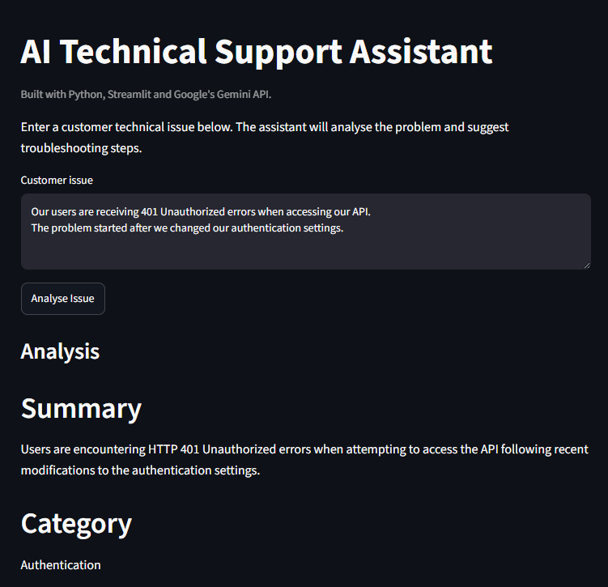
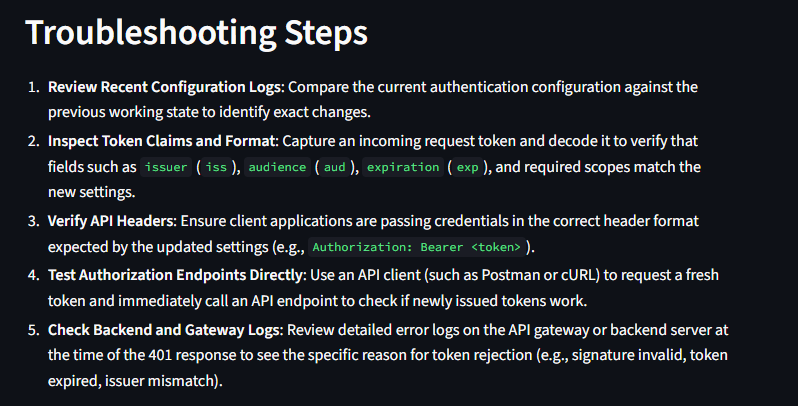
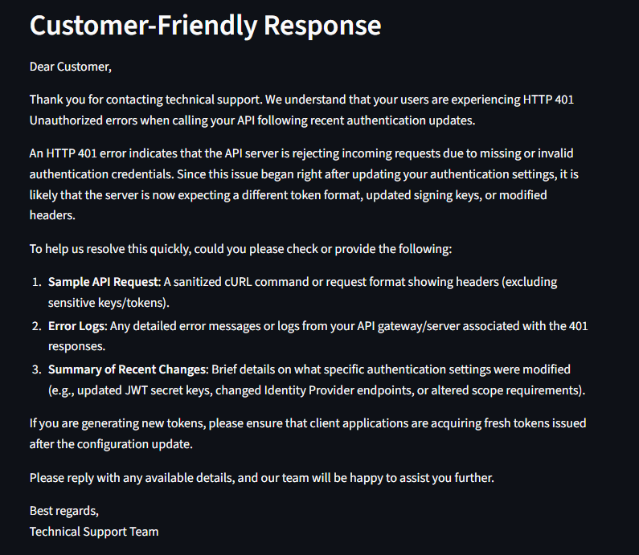

# AI Technical Support Assistant

A small Python application that uses Google's Gemini API to analyse technical support issues and turn them into clear, structured troubleshooting guidance.

I built this project to get more hands-on experience working with an AI API and to explore how generative AI could be used in a customer-facing technical support setting.

## What it does

Users can enter a technical issue in plain language and the application returns:

* a short summary of the problem
* a technical category
* a priority level
* possible causes
* troubleshooting steps
* a customer-friendly response

The aim is to take an unstructured support request and make it easier to understand and act on.

## Technologies used

* Python
* Google Gemini API
* Google GenAI SDK
* Streamlit
* python-dotenv
* Git/GitHub

## Example

A user might enter:

> Our users are receiving 401 Unauthorized errors when accessing our API. The problem started after we changed our authentication settings.

The application then identifies the issue as authentication-related, suggests possible causes and provides a set of troubleshooting steps.

## Screenshots

### Issue input and analysis



### Troubleshooting steps



### Customer response



## Running the project locally

Clone the repository and install the required packages:

```bash
pip install -r requirements.txt
```

Create a `.env` file in the project folder and add your Gemini API key:

```text
GEMINI_API_KEY=your_api_key_here
```

Then start the application:

```bash
streamlit run app.py
```

## What I learned

This project gave me practical experience with:

* connecting a Python application to an external API
* working with environment variables and API keys
* designing prompts to produce consistent, structured responses
* handling user input in a simple web interface
* using AI to support technical troubleshooting and communication

## Security

The API key is stored locally in a `.env` file and is excluded from the repository using `.gitignore`.
